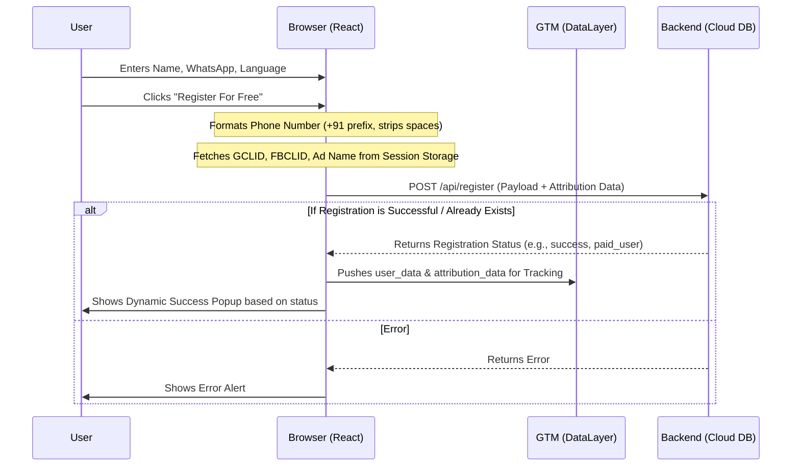
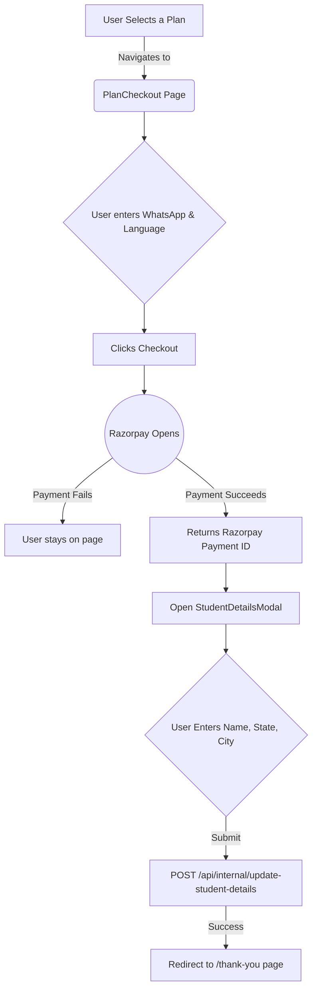

# 🧘 Healthyday Registration & Pricing Platform

Welcome to the **Healthyday Registration and Pricing Web Application**. This project handles user onboarding for both **Free Yoga Programs** and **Premium Subscription Plans**.

This documentation will help you understand **how the application works**, **how data flows** across the system, and **how to set it up**.

---

## 🛠️ Technology Stack

This application is built using modern web development tools:

*   **Frontend**: React 18 (Using functional components and Hooks)
*   **Build Tool**: Vite (Lightning-fast dev server and bundler)
*   **Styling**: Tailwind CSS (Utility-first CSS framework for quick styling)
*   **Routing**: React Router v6 (For navigating between pages like `/free-programmes` and `/checkout`)
*   **Payments**: Razorpay Integration (For seamless checkout)
*   **Analytics**: Google Tag Manager (GTM) dataLayer & Facebook Pixel (via session storage)

---

## 📂 Project Structure

Here is a simplified view of how the code is organized:

```text
pricing/
├── src/
│   ├── assets/              # Images, SVGs, and logos
│   ├── components/          # Reusable UI parts
│   │   ├── RegistrationSuccessPopup.tsx # Popup shown after free registration
│   │   ├── StudentDetailsModal.tsx      # Modal shown after a successful payment
│   │   ├── PhoneInputCustom.tsx         # Custom phone number input field
│   │   └── SharedHeader.tsx / SharedFooter.tsx
│   ├── pages/               # Main application pages
│   │   ├── free-programmes.tsx          # Free 14-day yoga registration page
│   │   ├── PlanCheckout.tsx             # Razorpay payment checkout page
│   │   ├── Home.tsx                     # Main pricing/home page
│   │   └── ThankYou.tsx                 # Success page after buying a plan
│   ├── App.tsx              # Main Router setup connecting all pages
│   └── index.css            # Global Tailwind styles
├── vite.config.ts           # Vite settings (includes API proxy configuration)
└── tailwind.config.ts       # Tailwind CSS design system rules
```

---

## ⚙️ Core Workflows (How things work)

To make it simple to understand, here are the **two main journeys** a user can take in this application.

### 1. Free Program Registration Flow (`/free-programmes`)

This flow allows a user to register for a 14-day free yoga challenge. It also tracks where the user came from (Attribution: Google Ads, Facebook Ads) and saves this in the database.



**Key Highlights in this flow:**
*   **Phone Formatting:** All phone numbers are cleaned (spaces/dashes removed) and prefixed with `+91`.
*   **Tracking:** Whenever someone registers successfully, their info (along with ad tracking parameters like `gclid` and `fbclid`) is pushed to `window.dataLayer`. This helps Marketing run better ads.

---

### 2. Premium Paid Plan Checkout Flow (`/checkout`)

When a user wants to buy a plan (like a 3-month or 6-month subscription), they go through the Razorpay checkout process.



**Key Highlights in this flow:**
*   **Razorpay SDK:** We load the Razorpay SDK directly on the page and open a secure payment window without leaving the website.
*   **Two-Step Process:** 
    1. First, we take the payment.
    2. Then, we ask for additional details (City, State) to complete their profile before routing them to the Thank You page.

---

## 🚀 Getting Started Locally

If you want to run this project on your own computer, follow these simple steps:

### 1. Prerequisites
Make sure you have [Node.js](https://nodejs.org/) installed on your computer.

### 2. Install Dependencies
Open your terminal, navigate to the project folder, and run:
```bash
npm install
```

### 3. Setup Environment Variables
You need a Razorpay key to test the payments. Create a `.env` file in the root directory and add:
```env
VITE_RAZORPAY_KEY_ID=your_test_key_here
```

### 4. Start the Application
Run the local development server:
```bash
npm run dev
```
Open your browser and visit `http://localhost:8080`.

> **💡 Note on APIs**: Notice that we use `/api/register`. Because of the `vite.config.ts` setup, any request made to `/api/*` on your local machine is automatically forwarded (proxied) to the live Healthyday backend server (`https://healthyday-backend-v2-773381060399.asia-south1.run.app`). You do not have to worry about CORS issues!
