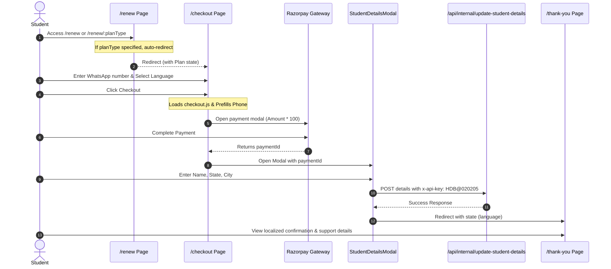

# Healthyday Subscription Renewal Flow Documentation

This document provides a detailed technical overview of the subscription renewal process (`/renew`) for the Healthyday web application. It covers the routing, page layouts, components, payment gateway integration, backend communications, and language preferences.

---

## 1. Directory Structure & Key Files

The renewal flow is built with **Vite**, **React (TypeScript)**, **Tailwind CSS**, and **React Router DOM**. The primary files involved in the `/renew` and checkout flow are:

* **Routing Config**: [`src/App.tsx`](file:///c:/Users/prath/OneDrive/Documents/@Downloads/@healthyday/@production/pricing/src/App.tsx)
* **Plan Selection Page**: [`src/pages/Renew.tsx`](file:///c:/Users/prath/OneDrive/Documents/@Downloads/@healthyday/@production/pricing/src/pages/Renew.tsx)
* **Checkout Page**: [`src/pages/PlanCheckout.tsx`](file:///c:/Users/prath/OneDrive/Documents/@Downloads/@healthyday/@production/pricing/src/pages/PlanCheckout.tsx)
* **Student Details Modal**: [`src/components/StudentDetailsModal.tsx`](file:///c:/Users/prath/OneDrive/Documents/@Downloads/@healthyday/@production/pricing/src/components/StudentDetailsModal.tsx)
* **Success Landing Page**: [`src/pages/ThankYou.tsx`](file:///c:/Users/prath/OneDrive/Documents/@Downloads/@healthyday/@production/pricing/src/pages/ThankYou.tsx)

---

## 2. Complete Renewal Flow Diagram

The following sequence diagram outlines the entire path from plan selection to successful registration:



---

## 3. Detailed Component Breakdown

### A. Routing Configuration (`src/App.tsx`)
The application defines two main routes targeting renewal:
1. `/renew`: Standard route for showing pricing cards and the comparison table.
2. `/renew/:planType`: Route containing a parameter for automatic plan pre-selection (e.g., `/renew/1year`, `/renew/6month`, `/renew/3month`).

---

### B. Renewal & Pricing Page (`src/pages/Renew.tsx`)
This page serves as the entry point for users looking to renew their subscription.

#### 1. Plan Types & Pricing Structure
The system offers three primary subscription models:
* **1 Year Plan** (Includes Diet)
  * **Original Price:** ₹5999
  * **Discount Price:** ₹1999 (Save 66%!)
  * **Status:** Highlighted as *Best Value*.
* **6 Months Plan**
  * **Original Price:** ₹2999
  * **Discount Price:** ₹1499 (Save 50%!)
* **3 Months Plan**
  * **Original Price:** ₹1499
  * **Discount Price:** ₹999 (Save 33%!)

#### 2. Auto-Redirect Logic
When a user visits a parameterized URL (like `/renew/1year`), the page immediately intercepts it via `useEffect` and redirects them to the checkout page:
```typescript
useEffect(() => {
    if (planType) {
        const planParam = planType.toLowerCase();
        let selectedPlan = null;
        if (planParam.includes('1year')) selectedPlan = plans[0];
        else if (planParam.includes('6month')) selectedPlan = plans[1];
        else if (planParam.includes('3month')) selectedPlan = plans[2];

        if (selectedPlan) {
            navigate('/checkout', { state: { plan: selectedPlan }, replace: true });
        }
    }
}, [planType, navigate]);
```

#### 3. Plan Interactive Comparison Table
* A dynamic features table compares the plans on components such as *Daily YOGA*, *Face YOGA*, *Breath Mastery*, *108 Surya Namaskar*, and *Masterclasses*.
* Clicking a plan column highlights it dynamically using a sliding absolute overlay:
  ```typescript
  style={{
      width: 'calc((100% - 30%) / 3)',
      left: `calc(30% + ${activePlan} * (100% - 30%) / 3)`,
  }}
  ```
* Clicking any "RENEW NOW" button routes the user to `/checkout` with the corresponding plan passed in the router state.

---

### C. Checkout Page (`src/pages/PlanCheckout.tsx`)
Handles contact collection, language preference selection, and payment invocation.

#### 1. Pre-requisites & State
* Resolves the selected plan from `location.state.plan`. If accessed directly without selection, it defaults to `defaultPlan` (6 Months Plan).
* Asynchronously loads the Razorpay SDK (`https://checkout.razorpay.com/v1/checkout.js`) on mount to avoid unnecessary blocking on other pages.

#### 2. User Prefills
* **WhatsApp Number:** Collected using a custom component (`PhoneInputCustom`) containing country dial-codes (defaults to India `+91`).
* **Class Language:** Radio selectors for **Telugu (తెలుగు)** and **English**.

#### 3. Razorpay Payment Gateway Integration
Upon form submission, the page reads the Razorpay Public Key from `import.meta.env.VITE_RAZORPAY_KEY_ID` and executes the payment flow:
* **Amount:** Multiplied by 100 (Razorpay processes amounts in paisa).
* **Prefill Object:** Sends the country code concatenated with the phone number.
* **Notes Metadata:** Sends `class_language` and `plan` name, which are visible in the Razorpay Dashboard.
* **Callback Handler:** On success, stores the `paymentId` and opens the student details modal:
  ```typescript
  handler: function (response: any) {
      setPaymentId(response.razorpay_payment_id);
      setShowModal(true);
  }
  ```

---

### D. Student Details Modal (`src/components/StudentDetailsModal.tsx`)
Appears post-payment to collect required regional details. This acts as the final validation step to register the user.

#### 1. Autocomplete Location Selectors
* Utilizes the `country-state-city` library to query valid geographical data for India (`IN`).
* Selecting a **State** automatically filters and updates the list of available **Cities** in the city selector.

#### 2. Database Update API Integration
Submits details to the server:
* **Endpoint:** `/api/internal/update-student-details`
* **Method:** `POST`
* **Headers:**
  * `Content-Type: application/json`
  * `x-api-key: HDB@020205`
* **Request Payload Structure:**
  ```json
  {
    "name": "User Name",
    "state": "State Name",
    "city": "City Name",
    "mobile": "+91XXXXXXXXXX",
    "paymentId": "pay_P12345abcde"
  }
  ```
* On success, routes the user to `/thank-you` while forwarding the selected `language` state.

---

### E. Thank You Success Page (`src/pages/ThankYou.tsx`)
A friendly, grid-aligned landing screen confirming the successful subscription registration.

#### 1. Multilingual Feedback
Displays content based on the chosen class language:
* **Telugu (`language === 'Telugu'`)**:
  * *Update Message:* కాసేపట్లో మీకు WhatsApp లో update వస్తుంది
  * *Fallback text:* ఒకవేల 5 minutes లోపు మీకు ఎటువంటి confirmation రాకపోతే, ఈ కింది number కి మీరు whatsapp లో message చేయొచ్చు
* **English (`language === 'English' / Default`)**:
  * *Update Message:* You will receive an update from us on WhatsApp.
  * *Fallback text:* In case you didn't receive any message in next 5 Minutes, Please Whatsapp us on the below number

#### 2. Direct Support Route
Provides a call-to-action button linking directly to WhatsApp Chat support (`https://wa.me/919052888968`) for manual confirmations.

---

## 4. Configuration and Environment Requirements

To run this flow properly in both development and production:

1. **Environment Variables**:
   A `.env` file must be present at the project root containing the Razorpay public key:
   ```env
   VITE_RAZORPAY_KEY_ID=rzp_live_xxxxxxxxxxxxxx
   ```
2. **API Proxying (Vite)**:
   In development, network requests to `/api/internal/update-student-details` are proxied to avoid CORS issues. This is configured in `vite.config.ts`.
3. **Static Assets**:
   * The page relies on `/logo.png` and several external images hosted on Amazon S3.
